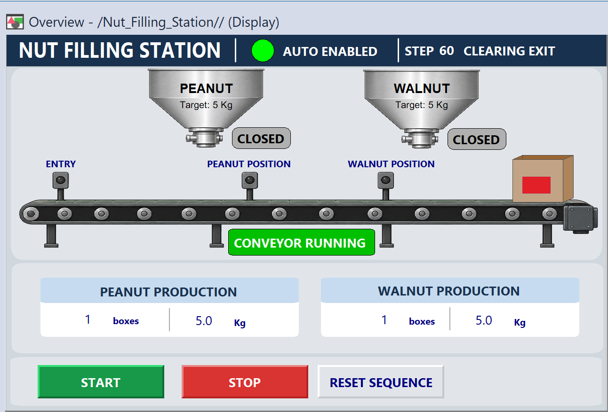
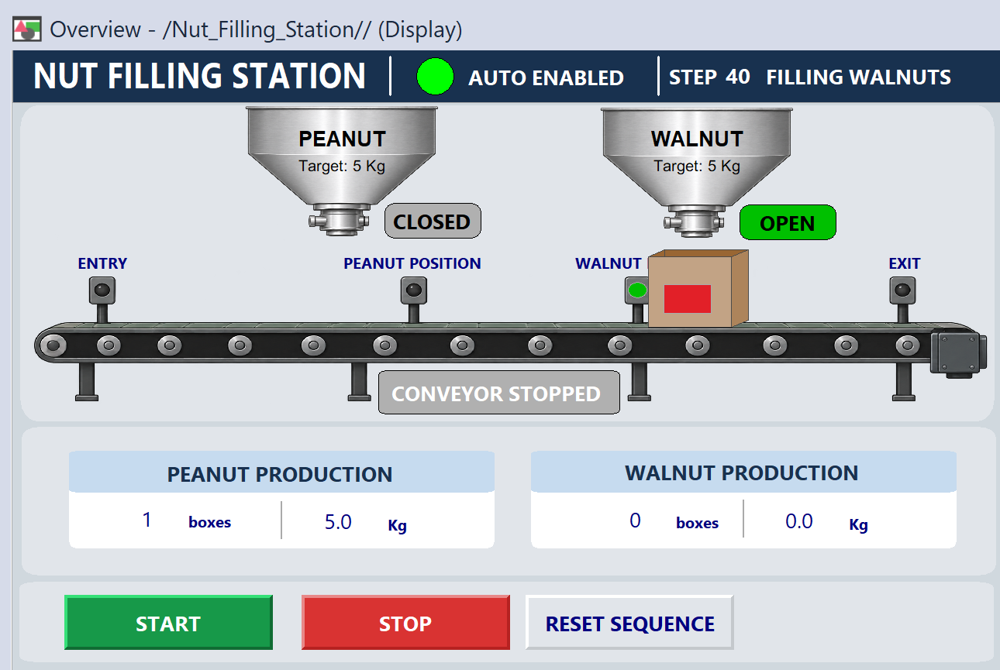
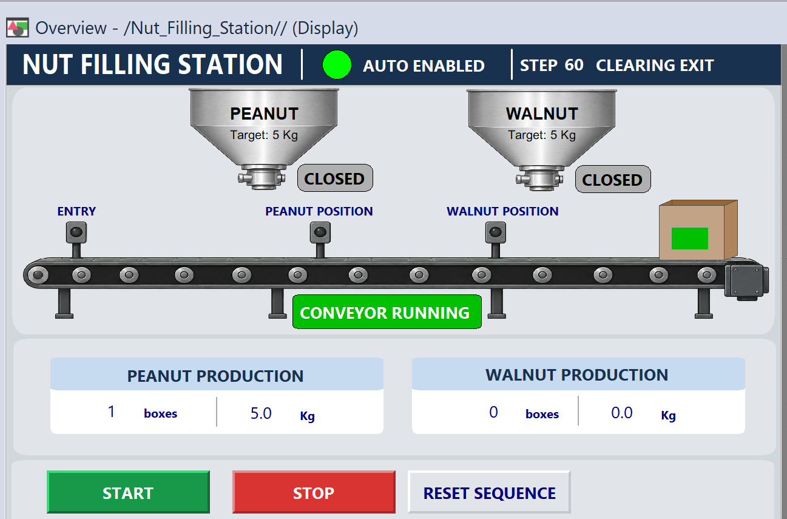

# Nut Filling Station — PLC & HMI Simulation

A conveyor filling simulation built with **Studio 5000 Logix Designer v33**, **Studio 5000 Logix Emulate**, and **FactoryTalk View Studio Machine Edition v12**.

The station identifies a box by its label, moves it to the correct hopper, fills it to a nominal target of **5 kg**, and sends it onward to the exit. The HMI displays the sequence, sensor states, hopper commands, and production totals.



## Operation

- **Green label:** fill with peanuts.
- **Red label:** fill with walnuts.
- Stop the conveyor when the box reaches its selected hopper.
- Open the selected hopper until its target-weight input is true.
- Close the hopper, count the completed box, and move it toward the exit.
- Return to the waiting state after the box clears the exit sensor.

The sequence handles **one box at a time**. Position and target-weight signals are simulated PLC inputs.

## Features

- Separate PLC routines for sequence transitions, outputs, and production totals.
- Start/stop control and sequence reset.
- Independent completed-box counters for peanuts and walnuts.
- Nominal packed-weight totals calculated from completed boxes.
- HMI indicators for automatic operation, current step, conveyor status, hopper status, and box-position sensors.
- Box graphics with label colors and visibility tied to the simulated process.
- Production-count reset control shown while automatic operation is stopped.

## HMI screenshots

### Walnut filling

At step 40, the conveyor is stopped and the walnut hopper is open.



### Completed peanut box

At step 60, the completed box is clearing the exit. The peanut total is one box, or 5.0 kg nominal.



## Software and configuration

| Component | Project configuration |
|---|---|
| PLC development | Studio 5000 Logix Designer v33 |
| PLC simulation | Studio 5000 Logix Emulate, Emulate 5570 controller |
| Emulator slot | 3 in the original setup |
| HMI development | FactoryTalk View Studio ME v12.00 |
| HMI display | `Overview`, 1280 × 800 design |
| HMI communication | FactoryTalk Linx shortcut named `PLC` |
| Fill target | 5 kg per completed box |

The required Rockwell Automation software and activations are installed separately.

## PLC structure

| Routine | Responsibility |
|---|---|
| `MainRoutine` | Run-enable control, first-scan initialization, sequence reset, and routine calls |
| `Sequence` | Capture the current step, evaluate transitions, and count completed fills |
| `Outputs` | Conveyor and hopper commands |
| `Production_Totals` | Production total calculations and count-reset logic |

`Step_Scan` captures `Step` at the beginning of the sequence routine. Transition conditions use this snapshot so a newly assigned step does not trigger another transition later in the same scan. Output logic uses the current `Step`.

### Sequence states

| Step | Description | Next condition |
|---:|---|---|
| 0 | Wait for a box and a valid label | Entry sensor plus exactly one label input |
| 10 | Move to the peanut hopper | `Peanut_PE` |
| 20 | Fill peanuts | `Peanut_PE` and `Peanut_Filled_Up` |
| 30 | Move to the walnut hopper | `Walnut_PE` |
| 40 | Fill walnuts | `Walnut_PE` and `Walnut_Filled_Up` |
| 50 | Move the completed box toward the exit | `Exit_PE` becomes true |
| 60 | Clear the exit | `Exit_PE` becomes false, returning to step 0 |

The conveyor runs during travel steps 10, 30, 50, and 60 when `Run_Enable` is true. It stops while waiting or filling. Stopping automatic operation retains the current sequence step; resetting the sequence returns it to 0.

## Key tags

| Tag | Type | Purpose |
|---|---|---|
| `Start_PB` | BOOL | Start request |
| `Stop_OK` | BOOL | 1 when stop is released; 0 when stop is pressed |
| `Reset_PB` | BOOL | Reset the sequence |
| `Run_Enable` | BOOL | Automatic operation enabled |
| `Entry_PE` | BOOL | Box detected at the entry |
| `Green_Label`, `Red_Label` | BOOL | Label detection inputs |
| `Peanut_PE`, `Walnut_PE`, `Exit_PE` | BOOL | Box-position sensors |
| `Peanut_Filled_Up`, `Walnut_Filled_Up` | BOOL | Simulated target-weight-reached inputs |
| `Conveyor_Run` | BOOL | Conveyor command |
| `Peanut_Open`, `Walnut_Open` | BOOL | Hopper commands |
| `Step`, `Step_Scan` | DINT | Current step and scan snapshot |
| `Peanut_Box_Count`, `Walnut_Box_Count` | COUNTER | Completed-box counters; totals are in `.ACC` |
| `Peanut_Total_kg`, `Walnut_Total_kg` | REAL | Nominal packed-weight totals |
| `Reset_Counts_PB` | BOOL | Production-count reset request |

`PE` means photoelectric sensor; `PB` means pushbutton.

### Packed-weight calculation

```text
Peanut_Total_kg = Peanut_Box_Count.ACC × 5.0
Walnut_Total_kg = Walnut_Box_Count.ACC × 5.0
```

These are **nominal totals**, not accumulated load-cell measurements. The fill-complete signals are Boolean inputs; this project does not measure or model a continuously increasing box weight.

## Files

| Path | Contents |
|---|---|
| `Nut_Filling_Station.ACD` | Native Studio 5000 PLC project |
| `Nut_Filling_Station.mer` | HMI |
| `FactoryTalk_View_Mockup.png` | Original HMI design reference |
| `Conveyor_With_Sensors.png` | Conveyor and sensor graphic |
| `Hopper_No_Text.png`, `Peanut_Hopper.png` | Hopper graphics |
| `Images/` | Additional project graphics |
| `docs/images/` | Screenshots of the completed HMI |


## Run the simulation

1. Open `Nut_Filling_Station.ACD` in Logix Designer v33.
2. Create or select a compatible emulated controller in Logix Emulate. The original project uses slot 3; ensure the project slot and emulator slot match.
3. Download to the intended emulator and place it in Run mode.
4. Restore the HMI application from its `.apa` backup once that backup is supplied.
5. In FactoryTalk Linx Communication Setup, assign the `PLC` shortcut to the emulated controller. Check the communication path for the local test/runtime environment.
6. Open the `Overview` display and test the HMI.
7. Initialize simulated sensors and fill-complete inputs to 0, set `Stop_OK` to 1, then reset the sequence and press Start.

Example HMI tag references:

```text
{::[PLC]Run_Enable}
{::[PLC]Step}
{::[PLC]Peanut_Box_Count.ACC}
{::[PLC]Walnut_Total_kg}
```

### Manual test: peanut box

1. Set `Entry_PE = 1`, `Green_Label = 1`, and `Red_Label = 0`. Expect step 10 and conveyor running.
2. Clear the entry and label inputs after the box leaves the entry.
3. Set `Peanut_PE = 1`. Expect step 20, conveyor stopped, and peanut hopper open.
4. Set `Peanut_Filled_Up = 1`. Expect the hopper to close, the peanut counter to increase once, and step 50.
5. Clear `Peanut_PE` and `Peanut_Filled_Up` as the box leaves.
6. Set `Exit_PE = 1`. Expect step 60.
7. Set `Exit_PE = 0`. Expect step 0 and the conveyor stopped.

For walnuts, use `Red_Label`, `Walnut_PE`, and `Walnut_Filled_Up`. The filling path is 0 → 30 → 40 → 50 → 60 → 0.

## Verification

During development, the PLC project reported **0 errors and 0 warnings**, and the manual simulation results were confirmed by the project author. The included HMI screenshots show:

- A completed peanut box with a total of 1 box / 5.0 kg.
- A walnut box filling at step 40.
- A completed walnut box at step 60 with both products totaling 1 box / 5.0 kg each.

This is an educational simulation. Physical weighing, conveyor motion feedback, and production-machine safety functions are outside its scope.

